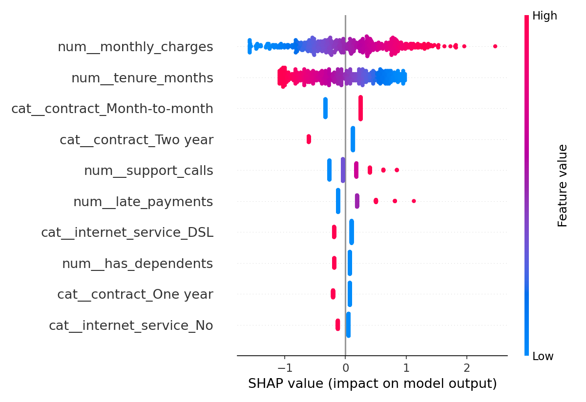

# Customer Churn Prediction & Driver Analysis

Predicts which telecom customers are likely to churn and explains *why* using
SHAP, so the business can act on the biggest churn drivers.

## How it works

1. **Synthetic data** — `src/generate_data.py` creates 5,000 customers with
   behavioral features (tenure, charges, contract type, support contacts,
   usage, late payments, …). The churn label comes from a known logistic
   function of a few drivers, so the analysis can be validated. All data is
   fictitious.
2. **Benchmarking** — `src/benchmark.py` compares `LogisticRegression`,
   `RandomForestClassifier` and `XGBClassifier` with 5-fold stratified
   cross-validation on ROC-AUC, refits the winner on the full data, and saves
   it to `models/best_model.joblib`.
3. **Driver analysis** — `src/shap_analysis.py` computes SHAP values for the
   best model (`TreeExplainer` for tree models, `LinearExplainer` for linear
   models) and saves a summary plot to
   `images/shap_summary.png`. If `shap` is not installed it falls back to
   permutation importance.

## Results

- 5-fold CV ROC-AUC: **LogisticRegression 0.769** (best), RandomForest 0.750,
  XGBoost 0.741. (The synthetic churn label is generated from a logistic
  function, so a linear model is the right winner here — a realistic outcome
  that the benchmark reports honestly.)
- Top churn drivers (mean |SHAP|, `LogisticRegression` + `LinearExplainer`):
  monthly charges, tenure, month-to-month contract, two-year contract,
  support-call volume, late payments — recovering the data-generating process.



## Retention recommendations

1. **Target month-to-month customers with annual-contract incentives.** Contract
   type is the single strongest churn driver; even a modest discount for
   switching to a 1–2 year term should cut churn in this segment.
2. **Proactive outreach after repeated support contacts.** Churn risk climbs
   with support-call volume — trigger a retention workflow (callback, credit,
   or plan review) after the 2nd unresolved contact.
3. **Early-tenure engagement + payment nudges.** Risk is highest in the first
   months and rises with late payments; onboarding check-ins and autopay
   incentives address both.

## How to run

```bash
pip install -r requirements.txt
python src/generate_data.py
python src/benchmark.py
python src/shap_analysis.py
```

## Project structure

```
customer-churn-prediction/
├── src/
│   ├── generate_data.py   # synthetic telecom customer generator
│   ├── benchmark.py       # CV benchmark of LR / RF / XGBoost
│   └── shap_analysis.py   # SHAP driver analysis + summary plot
├── data/                  # generated CSV (git-ignored; regenerate locally)
├── models/                # best model, CV results, importances (git-ignored)
├── images/                # SHAP summary plot
└── notebooks/            # exploratory analysis
```
